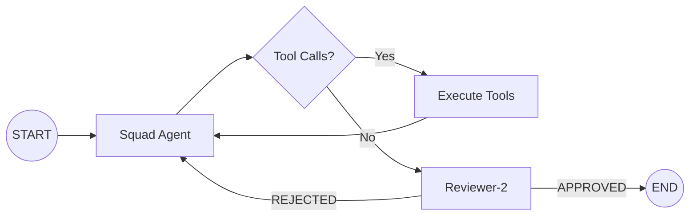

# Research Swarm 🐁🦉⚙️

**The Autonomous Multi-Agent Framework for Scientific Discovery & Policy Research**

> [!TIP]
> **Zero-Code Domain Adaptation**: Fork this repository, edit `swarm_config.yml`, and watch your specialized AI swarm come to life. No Python modifications required.

[](https://www.python.org/downloads/)
[](https://opensource.org/licenses/MIT)

---

## 🎯 The Vision

The Research Swarm is a production-grade **Multi-Agent System (MAS)** built on **LangGraph**. It orchestrates a specialized "Squad" of AI experts that autonomously research, debate, and document complex topics. 

While initially developed for **Regulatory Toxicology (FAIR-NAMs-Squad)**, this framework is now fully generalized. Whether you are in **Climate Science**, **Legal Tech**, or **Financial Modeling**, you can deploy a customized swarm by simply defining your personas and tools in a YAML configuration.

### 💎 Core Pillars

*   🛡️ **Scientific Rigor**: Built-in adversarial review loops (Reviewer-2) to eliminate hype and enforce objective tone.
*   📋 **Epistemic Traceability**: Every fact is logged in a real-time Traceability Matrix with confidence tags (`[FACT]`, `[INFERENCE]`).
*   🔌 **Extensible Tooling**: 8+ built-in tools for web search, PubMed, RAG, and persistent file I/O.
*   🛰️ **Provider Agnostic**: Seamlessly switch between **GPT-4o**, **Claude 3.5**, and **Gemini 2.0**.

---

## 🚀 Quickstart (5 Minutes)

```bash
# 1. Clone & Enter
git clone https://github.com/dhuzard/FAIR-NAMs-Squad.git && cd FAIR-NAMs-Squad

# 2. Automated Setup (Venv + Deps + .env)
make setup

# 3. Add Keys to .env
# OPENAI_API_KEY=sk-... 
# YOU_API_KEY=ydc-... (Optional for web search)

# 4. Run your first autonomous task
make run PROMPT="Research the latest EMA guidelines on Virtual Control Groups and summarize the findings."
```

> [!IMPORTANT]
> **Persistence**: Check the `./Drafts/` folder after a run to see the Markdown reports generated by the swarm.

---

## 🏗️ Generalization Architecture

The system is designed with a strict separation between **Orchestration Logic** and **Domain Knowledge**.

### 1. The Control Surface: `swarm_config.yml`
Everything from persona icons to the adversarial reviewer's "banned words" list is controlled here. 

```yaml
reviewer:
  banned_words: ["revolutionary", "game-changing", "groundbreaking"]
  required_elements: ["DOI citations", "Methodology section"]
  tone: "measured, evidence-based scientific analysis"
```

### 2. The Persona Layer
Drop Markdown files into `agents/*/persona.md` to define expertise. The system injects these into the agents' prompts at runtime.

### 3. The "Graph" Loop


---

## 👥 Persona Squad (Toxicology Default)

| Agent | Icon | Role | Technical Focus |
| :--- | :--- | :--- | :--- |
| **Dr. Nexus** | 👑 | **Orchestrator** | Coordination, synthesis, and conflict resolution. |
| **BioEthos** | 🐁 | **Ethics & Regs** | Animal welfare (3Rs), FDA/EMA regulatory alignment. |
| **Semantica** | 🦉 | **Ontologist** | FAIR Principles, JSON-LD, and semantic validation. |
| **TechLead** | ⚙️ | **Architect** | Turning requirements into deployable system specs. |
| **Journalist**| ✍️ | **Observer** | Neutral, professional documentation and reporting. |

---

## 🔧 Swiss-Army Tooling

| Tool | Capability | Purpose |
| :--- | :--- | :--- |
| 🔍 `search_you_engine` | **Web Intelligence** | Real-time web search via You.com API. |
| 📚 `search_pubmed` | **Literature** | Direct query of NCBI/PubMed/EuropePMC. |
| 📄 `scrape_webpage` | **Deep Reading** | Extracts full-text content from any discovered URL. |
| 🧠 `search_kb` | **Local RAG** | Searches your custom PDF/MD documents in agent KB folders. |
| ✍️ `write_section` | **Persistence** | Autonomously writes files to local disk. |
| 🔄 `git_snapshot` | **Version Control** | Auto-commits changes for a verifiable audit trail. |

---

## 🌍 Domain Scaffolding

Want to use this for another field? Use the built-in scaffolding tool:

```bash
make scaffold DOMAIN="Legal Tech"
```

### Ready-to-Use Examples:
Check the [`examples/`](examples/) folder for pre-built configurations:
- 📁 **[Legal Tech](examples/legal_tech/)**: Case law research and brief assembly.
- 📁 **[Climate Science](examples/climate_science/)**: Policy analysis and dataset synthesis.
- 📁 **[Financial Modeling](examples/financial_modeling/)**: Risk assessment and market reporting.

---

## 📂 Repository Layout

*   `automation/main.py`: The entry-point CLI.
*   `automation/graph.py`: The State-Machine routing logic.
*   `automation/config.py`: The dynamic prompt injection engine.
*   `agents/`: Personas and local Knowledge Bases (KB).
*   `Drafts/`: The automated output directory.
*   `Knowledge_Traceability_Matrix.md`: The real-time audit log of knowledge claims.

---

## 🐳 Docker Support

Deploy the entire swarm in a containerized environment:

```bash
docker compose build
docker compose run swarm execute "Research the impact of microplastics on human health."
```

---

## 🚀 CLI Power-User Reference

| Command | Action |
| :--- | :--- |
| `python -m automation.main execute "..."` | Trigger a new autonomous research task. |
| `python -m automation.main info` | Visual summary of current config, personas, and tools. |
| `python -m automation.main scaffold "NAME"` | Bootstrap a new domain configuration. |
| `python -m automation.ingest` | Vectorize PDFs/docs in `agents/*/KB/` into the local vector DB. |

---

## 📄 License

Distributed under the **MIT License**. See `LICENSE` for more information.
